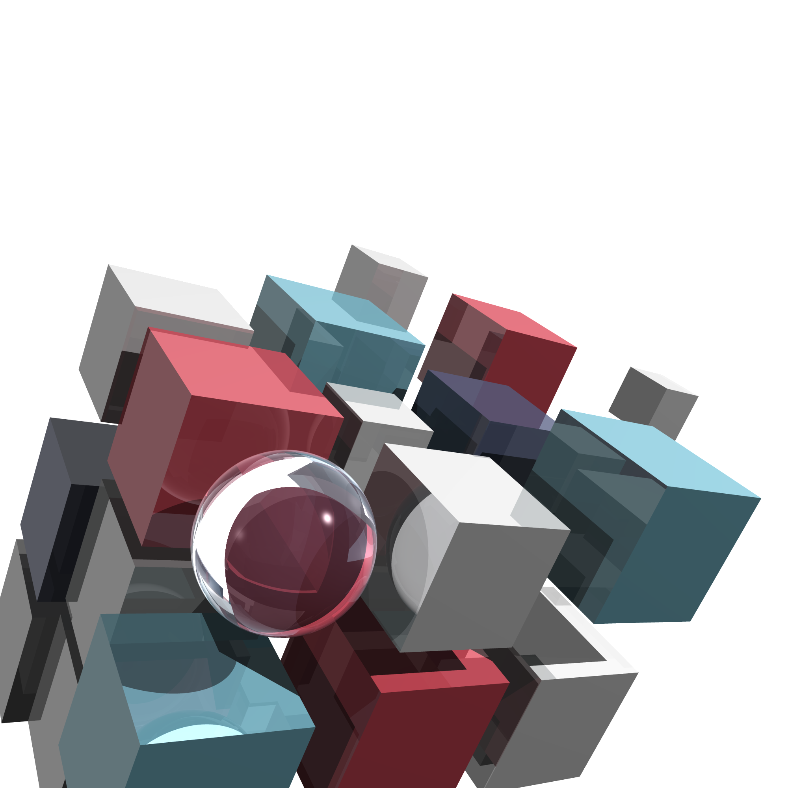
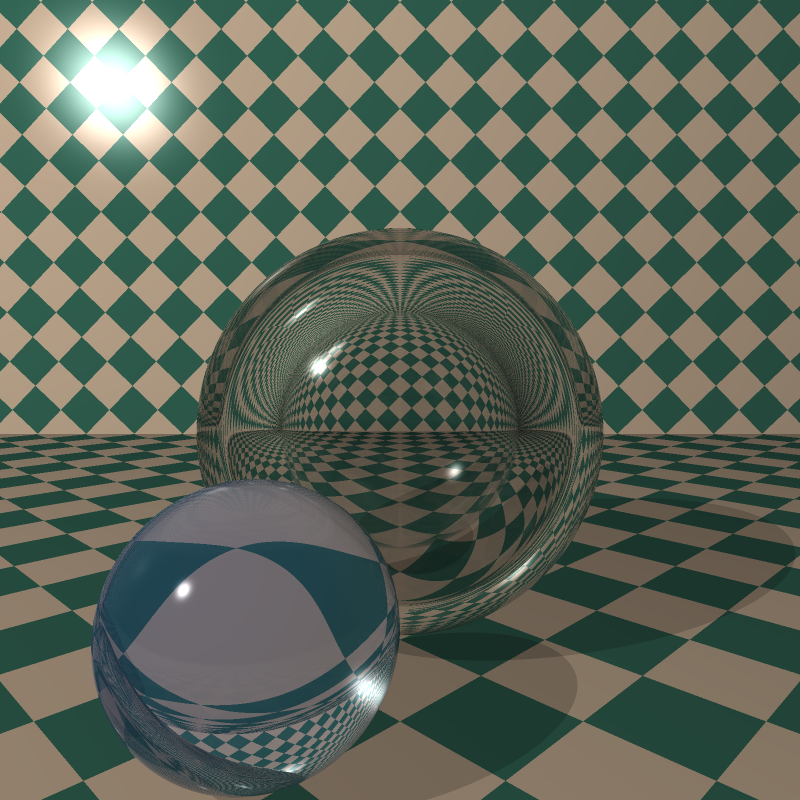
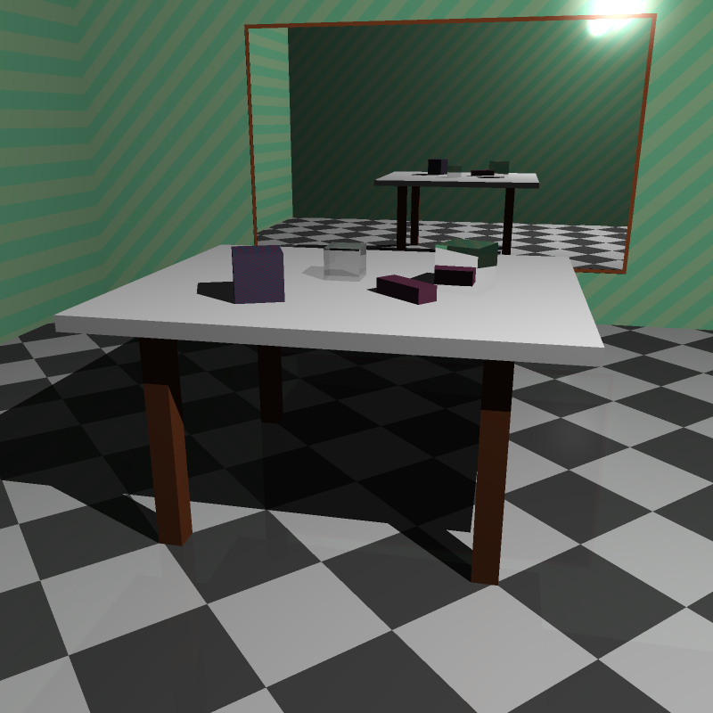
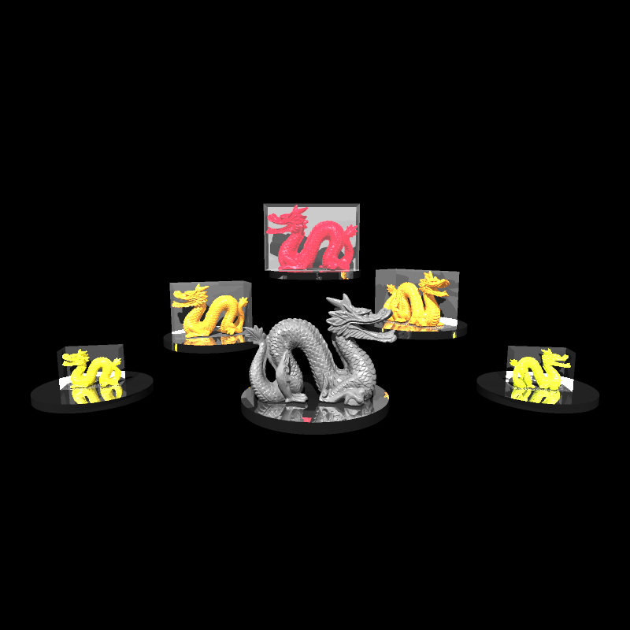

Simple raytracer that renders yaml scenes. Supports basic shapes and materials and .obj models

Command line usage:

```
Usage: raytracer [OPTIONS] <SCENE_FILE>

Arguments:
  <SCENE_FILE>  The scene file to render

Options:
  -f, --image-format <IMAGE_FORMAT>
          The format of the output image [default: png] [possible values: ppm, png]
  -o, --output-path <OUTPUT_PATH>
          The output path of the rendered image. By default it's `./<scene_filename>.<image_format>`
      --width <WIDTH>
          Width (in pixels) of the output image.
          Overrides the one in the scene file. If not specified anywhere, defaults to 800
      --height <HEIGHT>
          Height (in pixels) of the output image.
          Overrides the one in the scene file. If not specified anywhere, defaults to 800
      --fov <FOV>
          Field of view of the camera in radians. Overrides the one in the scene file If not specified anywhere, defaults to π/3
  -m, --max-reflective-depth <MAX_REFLECTIVE_DEPTH>
          Maximum number of times a ray can bounce off a reflective surface. Overrides the one in the scene file
  -s, --supersampling-level <SUPERSAMPLING_LEVEL>
          Controls how many rays are shot per pixel. In other words, the quality of the anti-aliasing (supersampling). Overrides the one in the scene file
  -h, --help
          Print help
```

## Sample images

- Cover image render 
- Refraction Chapter
- Cubes Chapter
- Dragons 
