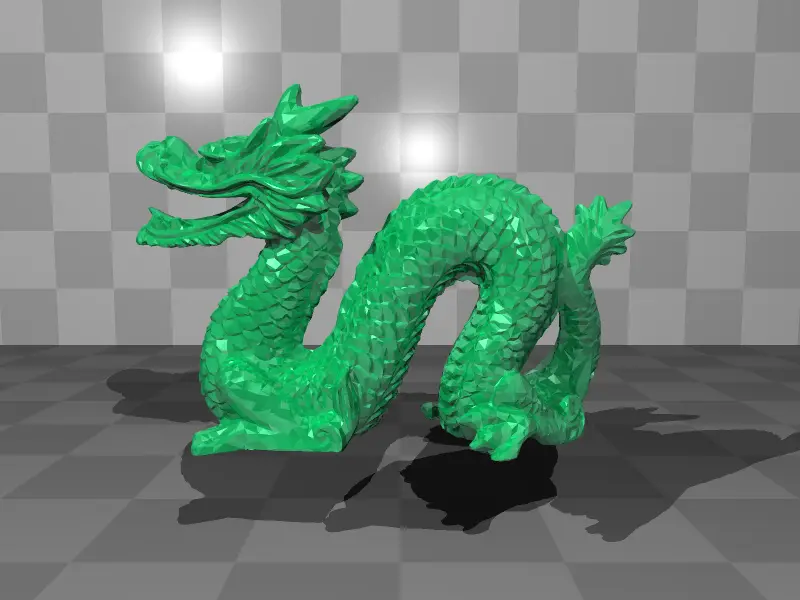
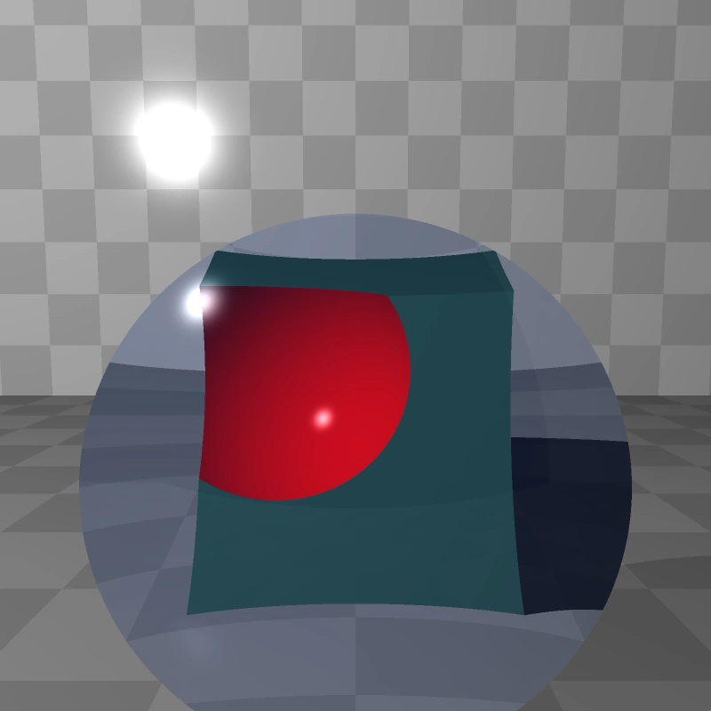
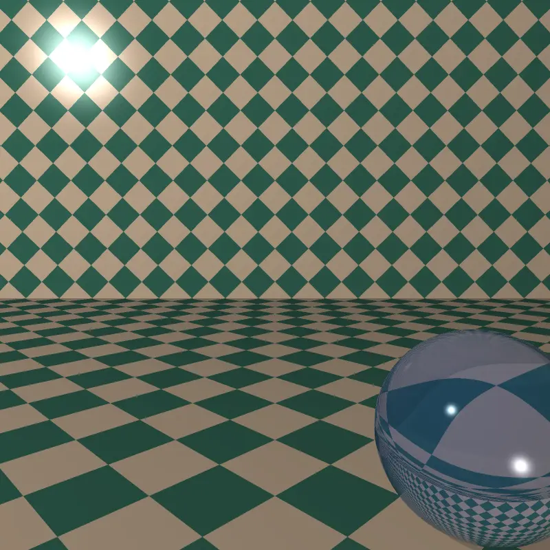
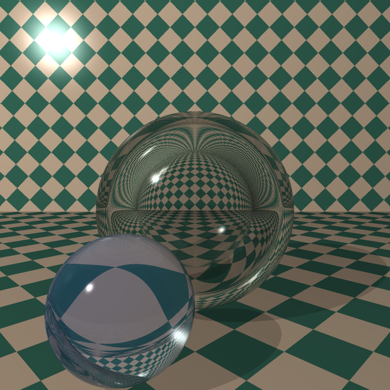
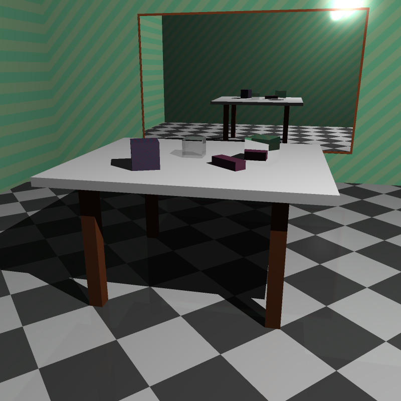
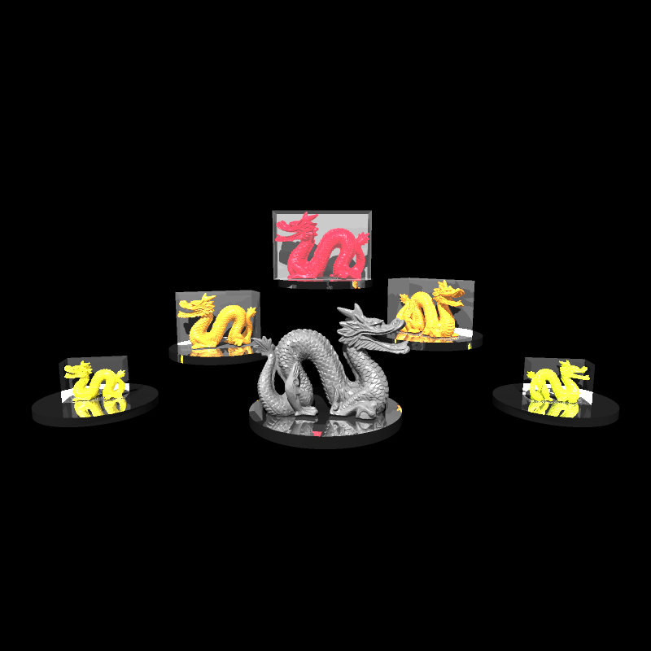

# Raytracer

A high-performance raytracer written in Rust that renders 3D scenes defined in YAML files. Supports basic shapes, materials, .obj models, and animations. The project aims to follow test-driven development and clean code principles to ensure maintainability, reliability, and readability.

## Features

- YAML scene definition with handy built-in constants like `PI`

- Render high-quality images and animations
- Support for .obj 3D models
- Material properties including reflection and refraction
- Animation support
- Multi-threaded rendering
- Bounding Volume Hierarchies (BVH) for fast ray intersection tests
- Anti-aliasing through super sampling

## Sample Renders

| Description          | Image                                                              |
| -------------------- | ------------------------------------------------------------------ |
| Cover image          |                           |
| Rotating dragon      |            |
| Animated lens        |                          |
| Animated refractions |  |
| Refraction example   |              |
| Cubes scene          |                         |
| Dragon models        |                             |

## Installation

1. Install [Rust](https://www.rust-lang.org/tools/install).

2. Clone and build the project:

```bash
git clone https://github.com/karolzwolak/raytracer.git
cd raytracer
cargo build --release
```

## Usage

### Basic Commands

Render a single image:

```bash
cargo run -r -- samples/scenes/dragon.yml image
```

Render an animation:

```bash
cargo run -r -- samples/animations/sphere.yml animate -d 2
```

### General usage

```
Simple raytracer that renders yaml scenes. Supports basic shapes and materials and .obj models. Can render single images and animations
Usage: raytracer [OPTIONS] <SCENE_FILE> <COMMAND>
Commands:
  image    Render a single image
  animate  Render an animation. Use `animate` field on an object to add animation to it
  help     Print this message or the help of the given subcommand(s)
Arguments:
  <SCENE_FILE>  The scene file to render
Options:
  -o, --output-path <OUTPUT_PATH>
          The output path of the rendered image. By default it's `./<scene_filename>.<image_format>`
  -w, --width <WIDTH>
          Width (in pixels) of the output image.
          Overrides the one in the scene file. If not specified anywhere, defaults to 800
  -h, --height <HEIGHT>
          Height (in pixels) of the output image.
          Overrides the one in the scene file. If not specified anywhere, defaults to 800
      --fov <FOV>
          Field of view of the camera in radians. Overrides the one in the scene file. If not specified anywhere, defaults to π/3
  -d, --depth <DEPTH>
          Maximum number of times a ray can bounce (change direction). Direction change occurs when a ray hits a reflective or refractive surface. Overrides the one in the scene file
  -s, --supersampling-level <SUPERSAMPLING_LEVEL>
          Controls how many rays are shot per pixel. In other words, the quality of the anti-aliasing (supersampling). Overrides the one in the scene file
  -h, --help
          Print help
```

### Rendering images

```
Render a single image
Usage: raytracer <SCENE_FILE> image [OPTIONS]
Options:
  -f, --format <FORMAT>  The format of the output image [default: png] [possible values: ppm, png]
  -h, --help             Print help
```

### Rendering animations

```
Render an animation. Use `animate` field on an object to add animation to it
Usage: raytracer <SCENE_FILE> animate [OPTIONS] --duration-sec <DURATION_SEC>
Options:
  -f, --format <FORMAT>              The format of the output video [default: mp4] [possible values: gif, mp4, webp]
  -d, --duration-sec <DURATION_SEC>  The duration of the output video in seconds
      --fps <FPS>                    Frames per second of the output video. Note that not all formats support all framerates. Use lower framerates when rendering to gif (about 30) [default: 60]
  -h, --help                         Print help
```

## Scene File Format

Scenes are defined in YAML format with support for reusable components through defines. The project includes example scenes in [scenes/](scenes/).

### Basic Structure

A scene file typically contains:

- Camera definition
- Light sources
- Objects with materials and transformations
- Optional scene settings (supersampling, recursion depth)

Example:

```yaml
- add: scene
  max-reflective-depth: 5
  supersampling-level: 2

- add: light
  intensity: WHITE
  at: [-10, 10, -10]

- add: SCENE_CAMERA
  from: [0, 1.5, -5]
  to: [0, 1, 0]
  up: [0, 1, 0]
  fov: FRAC_PI_3

- add: sphere
  material:
    color: BLUE
    diffuse: 0.7
    specular: 0.3
  transform:
    - [scale-uniform, 0.33]
    - [translate, -1.5, 0.33, -0.75]
```

### Defines

Reusable components can be defined and referenced using the `define` keyword. You can define:

1. **Colors**:

```yaml
- define: my-red
  value: [1, 0.2, 0.2]
```

2. **Numbers** (including mathematical constants):

```yaml
- define: my-scale
  value: 2.5
```

3. **Materials**:

```yaml
- define: shiny-metal
  value:
    ambient: 0.1
    diffuse: 0.6
    specular: 0.9
    shininess: 300
```

4. **Complete Objects**:

```yaml
- define: my-sphere
  value:
    add: sphere
    material: shiny-metal
    transform:
      - [scale, 2, 2, 2]
```

5. **Transformations**:

```yaml
- define: spin-and-move
  value:
    - [rotate-y, 0.5]
    - [translate, 1, 0, 0]
```

Defines can extend other defines:

```yaml
- define: base-material
  value:
    ambient: 0.5
    diffuse: 1

- define: red-material
  extend: base-material
  value:
    color: [1, 0, 0]
```

Once defined, you can reference these components anywhere in your scene:

```yaml
- add: my-sphere
  transform:
    - spin-and-move
```

### Built-in Defines

The raytracer provides several predefined constants and materials:

#### Mathematical Constants

- `PI`, `2_PI`
- `FRAC_PI_2`, `FRAC_PI_3`, `FRAC_PI_4`, `FRAC_PI_6`
- `FRAC_1_SQRT_2`

#### Colors

- `WHITE`, `BLACK`
- `RED`, `GREEN`, `BLUE`

#### Materials

- `GLASS_MATERIAL`
- `MIRROR_MATERIAL`
- `AIR_MATERIAL`

#### Scene Components

- `SCENE_LIGHT`
- `SCENE_CAMERA`

Example usage:

```yaml
- add: cube
  material: GLASS_MATERIAL
  transform:
    - [rotate-x, FRAC_PI_4]
```

### Notable Examples

- [Rotating dragon animation](samples/animations/dragon.yml)
- [Glass sphere scene](samples/scenes/glass_sphere.yml)
- [Refraction demo](samples/scenes/refractions.yml)

## Configuration

Configuration options can be set through:

1. Command line arguments (overrides all other options)
2. Scene YAML file

## Contributing

We welcome contributions! Please follow these steps:

1. Fork the repository
2. Create a feature branch (`git checkout -b feature/AmazingFeature`)
3. Commit your changes (`git commit -m 'Add some AmazingFeature'`)
4. Push to the branch (`git push origin feature/AmazingFeature`)
5. Open a Pull Request

Please ensure your code follows Rust best practices and includes appropriate tests.
